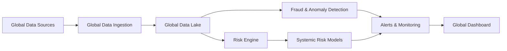
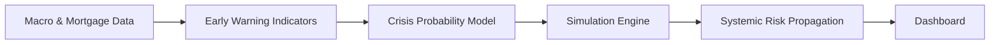

# 📉 2008 Crisis Research Platform

> **A full-stack research platform for analyzing mortgage data, macroeconomic series, and systemic risk dynamics surrounding the 2008 Global Financial Crisis.**
> Built for academic research, financial modeling, and early-warning intelligence.

---


---

## 📌 Overview

The **2008 Crisis Research Platform** integrates public mortgage datasets (Freddie Mac, Fannie Mae), macroeconomic indicators (FRED / World Bank), and financial market series into a unified pipeline for credit risk modeling, systemic risk analysis, and crisis probability forecasting.

The architecture spans data ingestion, ETL, feature engineering, ML model training, knowledge graph construction, agent-based simulation, and a real-time monitoring dashboard — all instrumented with MLflow and validated with Great Expectations.

---

## 🏗️ Architecture

```
┌─────────────────────────────────────────────────────────────────────┐
│                   2008 CRISIS RESEARCH PLATFORM                     │
│                                                                     │
│  ┌──────────────┐    ┌──────────────┐    ┌──────────────────────┐  │
│  │  Data Sources│    │   Pipeline   │    │     AI / ML Layer    │  │
│  │              │    │              │    │                      │  │
│  │  Freddie Mac │───►│  Ingestion   │───►│  XGBoost / LightGBM  │  │
│  │  Fannie Mae  │    │  Validation  │    │  Autoencoder / LSTM  │  │
│  │  FRED API    │    │  Transform   │    │  Temporal Fusion     │  │
│  │  World Bank  │    │  Features    │    │  Cox Survival Model  │  │
│  └──────────────┘    └──────┬───────┘    └──────────┬───────────┘  │
│                             │                        │              │
│  ┌──────────────────────────▼────────────────────────▼───────────┐ │
│  │                     Storage Layer                              │ │
│  │   data/raw  ──►  data/staging  ──►  data/processed (Parquet)  │ │
│  └────────────────────────────────────────────────────────────────┘ │
│                             │                                       │
│  ┌──────────────────────────▼──────────────────────────────────┐   │
│  │                  Intelligence Layer                          │   │
│  │  ┌────────────┐  ┌────────────┐  ┌──────────────────────┐  │   │
│  │  │   Neo4j    │  │  Systemic  │  │   Early Warning      │  │   │
│  │  │ Knowledge  │  │    Risk    │  │   Signals + Crisis   │  │   │
│  │  │   Graph    │  │   Engine   │  │   Probability Model  │  │   │
│  │  └────────────┘  └────────────┘  └──────────────────────┘  │   │
│  └──────────────────────────────────────────────────────────────┘   │
│                             │                                       │
│  ┌──────────────────────────▼──────────────────────────────────┐   │
│  │           Output Layer: Streamlit Global Dashboard           │   │
│  └──────────────────────────────────────────────────────────────┘   │
└─────────────────────────────────────────────────────────────────────┘
```

### Global Financial Intelligence Flow



### Financial Crisis Simulator Flow



---

## 📁 Project Structure

```
.
├── data/
│   ├── raw/                    # Raw downloads (partitioned by YYYYMMDD)
│   ├── staging/                # Intermediate Parquet files
│   └── processed/              # Final feature datasets for training
├── src/
│   ├── ingestion/              # Freddie, Fannie, FRED downloaders
│   ├── etl/                    # Loan & macro transformations
│   ├── features/               # Feature engineering & risk features
│   ├── models/                 # Baseline training & evaluation
│   ├── pipeline/               # Orchestrated pipeline steps
│   ├── systemic_risk/          # Network & contagion models
│   ├── timeseries/             # ARIMA / LSTM macro forecasting
│   ├── early_warning/          # EWS indicators & crisis probability
│   ├── knowledge_graph/        # Neo4j graph builder & Cypher queries
│   ├── global_data/            # World Bank & multi-country ingestion
│   └── security/               # Auth, governance, audit logging
├── mlops/
│   ├── train_pipeline.py
│   ├── register_model.py
│   ├── model_monitoring.py
│   ├── data_pipeline.py
│   ├── financial_dataset_pipeline.py
│   └── simulation_pipeline.py
├── notebooks/
│   ├── 01_exploratory.ipynb
│   └── 02_model_baseline.ipynb
├── dashboard/
│   ├── app.py                  # Main Streamlit dashboard
│   └── global_dashboard.py     # Global financial intelligence view
├── config/
│   └── early_warning_sources.json
├── mlflow/                     # Local MLflow tracking store
├── models/                     # Persisted model artifacts
├── infra/
│   ├── docker/
│   └── terraform/              # AWS · GCP · Azure · Oracle
├── requirements.txt
└── .env.example
```

---

## ⚙️ Requirements & Setup

**Prerequisites:** Python 3.10+, Docker, Docker Compose

```bash
# Clone and set up environment
git clone https://github.com/<your-org>/2008-crisis-research.git
cd 2008-crisis-research

python -m venv .venv
source .venv/bin/activate        # Windows: .venv\Scripts\activate
pip install -r requirements.txt

# Copy and configure environment variables
cp .env.example .env
```

---

## 🔑 Environment Variables

| Variable | Description |
|----------|-------------|
| `FREDDIE_USER` / `FREDDIE_PASS` | Freddie Mac data access credentials |
| `FANNIE_USER` / `FANNIE_PASS` | Fannie Mae data access credentials |
| `FRED_API_KEY` | FRED (Federal Reserve) API key |

---

## 🔄 Data Ingestion

Each script downloads raw data to `data/raw/YYYYMMDD/`.

```bash
# Freddie Mac loan performance sample
python -m src.ingestion.download_freddie --url "https://.../sample.zip"

# Fannie Mae loan performance sample
python -m src.ingestion.download_fannie --url "https://.../sample.zip"

# FRED macroeconomic series
python -m src.ingestion.download_fred --series "MORTGAGE30US" --start 2000-01-01

# Global data (FRED + World Bank multi-country)
python -m src.global_data.global_data_ingestion \
  --fred-series "MORTGAGE30US" \
  --wb-indicators "NY.GDP.MKTP.CD"
```

---

## 🔧 ETL Pipeline

Converts raw CSVs to Parquet, partitioned by year/month, and exports a training-ready dataset to `data/processed/`.

```bash
# Transform raw loan data
python -m src.etl.transform_loans --input data/raw --output data/staging

# Aggregate macro indicators
python -m src.etl.aggregate_macro --input data/raw --output data/staging

# Build features
python -m src.features.build_features --input data/staging --output data/processed
```

---

## 🚀 Advanced Pipelines (Orchestrated)

Run end-to-end with built-in Great Expectations validation at each step.

```bash
# Ingestion with validation
python -m src.pipeline.pipeline_ingest \
  --fred-series "MORTGAGE30US" \
  --start 2000-01-01 \
  --validate

# Transform
python -m src.pipeline.pipeline_transform \
  --input data/raw --output data/staging --validate

# Feature engineering
python -m src.pipeline.pipeline_features \
  --staging data/staging --processed data/processed --validate

# Training
python -m src.pipeline.pipeline_training \
  --processed data/processed --mlflow ./mlflow --out ./models
```

---

## 🤖 Model Training & Evaluation

```bash
# Start MLflow UI
mlflow ui --backend-store-uri ./mlflow

# Train baseline model (XGBoost or LightGBM)
python -m src.models.train_baseline --data data/processed

# Evaluate model
python -m src.models.evaluate --data data/processed
```

---

## 🧠 AI Models

| Category | Models |
|----------|--------|
| **Classical ML** | XGBoost, LightGBM, Isolation Forest |
| **Deep Learning** | Autoencoder, LSTM, Temporal Fusion Transformer |
| **Survival Analysis** | Cox Proportional Hazards |
| **Time Series** | ARIMA, Prophet |

---

## 📡 MLOps Helpers

```bash
# Full training pipeline
python -m mlops.train_pipeline \
  --processed data/processed --mlflow ./mlflow --out ./models

# Register model to MLflow Model Registry
python -m mlops.register_model \
  --model-path models/xgboost_target_default.json \
  --name xgb_default

# Drift & performance monitoring
python -m mlops.model_monitoring \
  --data data/processed/features.parquet

# Mock market data pipeline
python -m mlops.data_pipeline --mock-market

# Build financial dataset for early warning system
python -m mlops.financial_dataset_pipeline \
  --config config/early_warning_sources.json \
  --country all

# Run contagion simulations
python -m mlops.simulation_pipeline \
  --out data/simulation_results.parquet
```

---

## 🌐 Systemic Risk Analysis

The `src/systemic_risk/` module builds exposure networks and simulates financial contagion across tiers: **Institution → Sector → Country → Global**.

The systemic score is derived from network centrality metrics and exposure-weighted propagation models.

**Stress scenarios supported:**

| Scenario | Description |
|----------|-------------|
| Liquidity shock | Sudden withdrawal of interbank funding |
| Credit default cascade | Sequential counterparty defaults |
| Housing price collapse | HPI decline propagating to MBS portfolios |
| Sovereign debt contagion | Cross-border government debt spillover |

---

## ⏱️ Time Series Forecasting

```bash
python -m src.timeseries.macro_forecasting \
  --input data/staging/macro.parquet \
  --target-col value \
  --model arima          # options: arima | lstm | tft
```

---

## 🚨 Early Warning System

Build risk indicators and train crisis probability models from mortgage, macro, HPI, and market data.

```bash
# Build early warning indicators
python -m src.early_warning.risk_indicator_builder \
  --loans    data/staging/loans.parquet \
  --macro    data/staging/macro.parquet \
  --hpi      data/staging/housing_price.parquet \
  --market   data/staging/market.parquet

# Train EWS models
python -c "
import pandas as pd
from src.early_warning.early_warning_model import train_early_warning_models
df = pd.read_parquet('data/financial_dataset.parquet')
df['target'] = 0
print(train_early_warning_models(df, 'target'))
"

# Score crisis probability
python -c "
import pandas as pd
from src.early_warning.crisis_probability_model import build_crisis_probability
df = pd.read_parquet('data/financial_dataset.parquet')
df['target'] = 0
out = build_crisis_probability(df, 'target')
out.to_parquet('data/financial_dataset.parquet', index=False)
"
```

---

## 🕸️ Knowledge Graph (Neo4j)

Pre-built Cypher queries live in `src/knowledge_graph/queries.py`.
Run them via `run_queries` in `src/knowledge_graph/graph_builder.py`.

Entities modeled: financial institutions, bilateral exposures, contagion pathways, and geographic risk clusters.

---

## 📊 Dashboard

```bash
# Main dashboard — loans, risk scores, EWS, simulation results
streamlit run dashboard/app.py

# Global financial intelligence view
streamlit run dashboard/global_dashboard.py
```

---

## 🗒️ Notebooks

```bash
jupyter lab
```

| Notebook | Description |
|----------|-------------|
| `notebooks/01_exploratory.ipynb` | EDA on loan performance and macro series |
| `notebooks/02_model_baseline.ipynb` | Baseline model walkthrough and evaluation |

---

## ✅ Tests & Linting

```bash
pytest
flake8
```

---

## ☁️ Cloud Deployment (AWS · GCP · Azure · Oracle)

The `infra/terraform/` directory contains ready-to-use templates to provision a Docker-enabled VM on any supported cloud provider.

```bash
# Navigate to your cloud provider directory
cd infra/terraform/<provider>    # aws | gcp | azure | oracle

terraform init
terraform apply \
  -var "app_repo=<YOUR_REPO_URL>" \
  -var "app_ref=main"
```

> 🔒 Always restrict `admin_cidr` to your own IP address and avoid exposing sensitive ports publicly.

---

## 📬 Data Sources

| Source | Type | Access |
|--------|------|--------|
| [Freddie Mac Single Family](https://www.freddiemac.com/research/datasets) | Loan-level performance | Registration required |
| [Fannie Mae Single Family](https://capitalmarkets.fanniemae.com/mortgage-backed-securities/single-family/loan-performance-data) | Loan-level performance | Registration required |
| [FRED — Federal Reserve](https://fred.stlouisfed.org/) | Macro & rate indicators | Free API key |
| [World Bank Open Data](https://data.worldbank.org/) | Global macro indicators | Public API |
| Financial market indices | Prices, volatility | Mock connectors included |

---

<p align="center">
  <sub>Built for academic research · Not intended for production financial decisions</sub>
</p>
